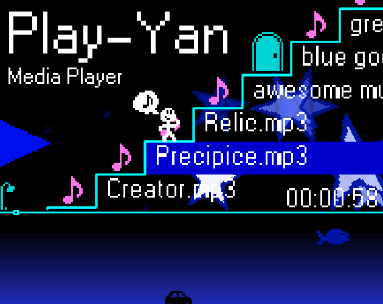

This is a recreation of the Play-Yan media player, an obscure media player made for the GBA.

Music is stored in AppData > play-yan > music

Drag mp3, wav, or ogg files onto the window to add them to the music folder.

### Controls
- A/D - Rewind/Fast Forward
- W/S (when media is playing) - Increase/decrease volume
- Z (when media is playing) - Change playback mode between loop, loop song, shuffle, and play song
- Space - Play
- W - Exit folder

### Notice any innacuracies?
If you find something that is not the same as how it is on the original Play-Yan, please let me know in the issues tab! I do not own a Play-Yan myself, so I only have the few videos I could find online about this media player as a reference.
