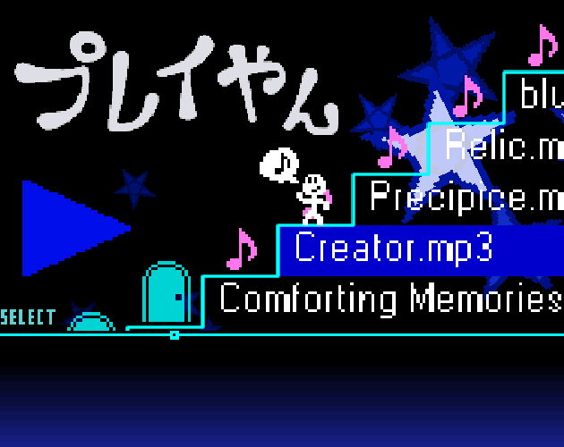

This is a recreation of the Play-Yan, an obscure media player made for the GBA.

Music is stored in AppData > play-yan > music. They must be in mp3, wav, or ogg format. You can put songs into folders, but folders inside of folders will not work.

Videos are stored in AppData > play-yan > video. They must be in ogv format. Yeah, this is a weird format that I don't think many people use, but it's the only thing that Love2D supports... sorry! Also, folders will not work here.

# Controls

### Main Menu
- W/S - Select media type
- Space - Open menu for media type

### Music
- A/D - Rewind/Fast Forward
- W/S (when music is playing) - Increase/decrease volume
- Left arrow/Right arrow - Seek through music
- Shift (when seeking through music) - Seek faster
- Z (when music is playing) - Change playback mode between loop, loop song, shuffle, and play song
- J - Make Play-Yan get groovy to your music!
- Space - Play/Pause
- Escape (when music is playing) - Stop song
- Escape (when not playing) - Exit folder/Return to menu

### Video Menu
- W/A/S/D - Navigate videos
- Space - Play videos
- Escape - Return to menu

### Video Playback
- W/S - Increase/decrease volume
- Left arrow/Right arrow - Seek through video
- Shift (when seeking through music) - Seek faster
- Space - Play/Pause
- Escape - Return to video menu

# Known Issues
Video thumbnails sometimes will not appear, and seeking through video can be buggy. Sorry about this: Love2D's video support is... not great.

# Missing Features
- Light mode
- Minigames

# Notice any innacuracies?
If you find something that is not the same as how it is on the original Play-Yan, please let me know in the issues tab! I do not own a Play-Yan myself, so I only have the few videos I could find online about this media player as a reference.
